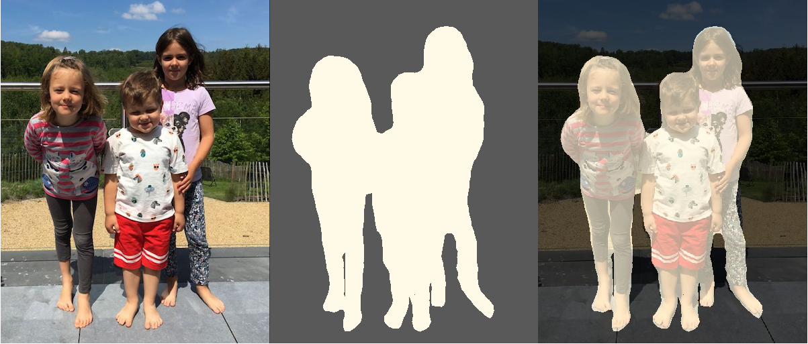

//tag::ref-doc[]
= Semantic Segmentation (Java 2D/Graphics 2D) Processor

Real-time Semantic Image Segmentation processor with Tensorflow, Java and Spring Cloud Stream. This implementation uses
the state-of-art deep learning, Tensorflow model: https://github.com/tensorflow/models/tree/master/research/deeplab[DeepLab].

> Semantic Segmentation is the process of associating each pixel of an image with a class label, (such as flower, person, road, sky, ocean, or car).

The `semantic segmentation` produces class-aware masks, unlike the `instance segmentation` produces instance-aware region masks.
For `instance segmentation` check the https://github.com/spring-cloud-stream-app-starters/tensorflow/tree/master/spring-cloud-starter-stream-processor-object-detection[SCDF Object Detection Processor].

The image processing tasks required for preparing the inputs and processing the outputs of the Tensorflow models are implemented in https://docs.oracle.com/javase/tutorial/2d/overview/index.html[Java 2D Graphics].

The link:../spring-cloud-starter-stream-processor-semantic-segmentation-cv[semantic-segmentation-cv] is a mirror implementation of the processor that uses the same Tensorflow models but uses https://github.com/bytedeco/javacv[JavaCV/OpenCV API] for implementing the image-processing tasks.


Three sets of pre-trained models, ready to use:

* https://github.com/tensorflow/models/blob/master/research/deeplab/g3doc/model_zoo.md#deeplab-models-trained-on-pascal-voc-2012[PASCAL VOC 2012]



* https://github.com/tensorflow/models/blob/master/research/deeplab/g3doc/model_zoo.md#deeplab-models-trained-on-cityscapes[DeepLab models trained on Cityscapes]

image:src/main/resources/doc/cityscape-all-small.png[]

* https://github.com/tensorflow/models/blob/master/research/deeplab/g3doc/model_zoo.md#deeplab-models-trained-on-ade20k[DeepLab models trained on ADE20K]

image:src/main/resources/doc/ADE20K-all-small.png[]

Download the preferred model tar.gz from the https://github.com/tensorflow/models/blob/master/research/deeplab/g3doc/model_zoo.md[model zoo] uncompress it and use the `frozen_inference_graph.pb` inside as model.

```
stream create ss2 --definition "frame-grabber --width=640 --height=480 --capture-interval=1500 | semantic-segmentation --tensorflow.model-fetch='SemanticPredictions:0'  --tensorflow.model='file:/<FULL PATH TO>/frozen_inference_graph.pb' | log" --deploy
```

===== References:

* https://ai.googleblog.com/2018/03/semantic-image-segmentation-with.html[Semantic Image Segmentation with DeepLab in TensorFlow]
* https://github.com/tensorflow/models/tree/master/research/deeplab[DeepLab Project]


NOTE: This processor is in an experimental state

== Options

//tag::configuration-properties[]
$$semantic.segmentation.mask-blending-enabled$$:: $$When true the semantic segmentation masks are blend with the input image.$$ *($$Boolean$$, default: `$$true$$`)*
$$semantic.segmentation.mask-transparency$$:: $$Blended mask transparency. Value is between 0.0 (0% transparency) and 1.0 (100% transparent).$$ *($$Double$$, default: `$$0.3$$`)*
$$tensorflow.expression$$:: $$How to obtain the input data from the input message. If empty it defaults to the input message payload.
 The payload.myInTupleName expression treats the input payload as a Tuple, and myInTupleName stands for
 a Tuple key. The headers[myHeaderName] expression to get input data from message's header using
 myHeaderName as a key.$$ *($$Expression$$, default: `$$<none>$$`)*
$$tensorflow.mode$$:: $$Defines how to store the output data and if the input payload is passed through or discarded.
 Payload (Default) stores the output data in the outbound message payload. The input payload is discarded.
 Header stores the output data in outputName message's header. The the input payload is passed through.
 Tuple stores the output data in an Tuple payload, using the outputName key. The input payload is passed through
 in the same Tuple using the 'original.input.data'. If the input payload is already a Tuple that contains
 a 'original.input.data' key, then copy the input Tuple into the new Tuple to be returned.$$ *($$OutputMode$$, default: `$$<none>$$`, possible values: `payload`,`tuple`,`header`)*
$$tensorflow.model$$:: $$The location of the TensorFlow model file.$$ *($$Resource$$, default: `$$<none>$$`)*
$$tensorflow.model-fetch$$:: $$The TensorFlow graph model outputs. Comma separate list of TensorFlow operation names to fetch the output Tensors from.$$ *($$List<String>$$, default: `$$<none>$$`)*
$$tensorflow.output-name$$:: $$The output data key used in the Header or Tuple modes.$$ *($$String$$, default: `$$result$$`)*
//end::configuration-properties[]

//end::ref-doc[]

== Build

Build involves two-stages. First build the apps and generate the binder specific app starters projects:
```
$ ./mvnw clean install -PgenerateApps
```

You can find the corresponding binder based projects in the `apps` subfolder. You can then cd into the apps folder:

```
$ cd apps
```
and build all binder projects
```
$ ./mvnw clean package
```

== Examples

```
java -jar semantic-segmentation-processor.jar ... use the properties TODO
```

And here is a example pipeline that uses semantic-segmentation:

```
semantic-segmentation-stream= TODO
```

